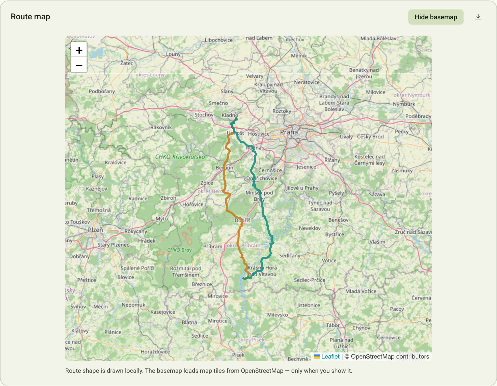
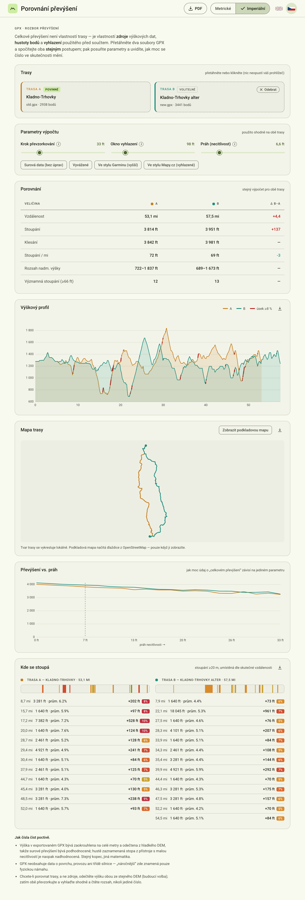
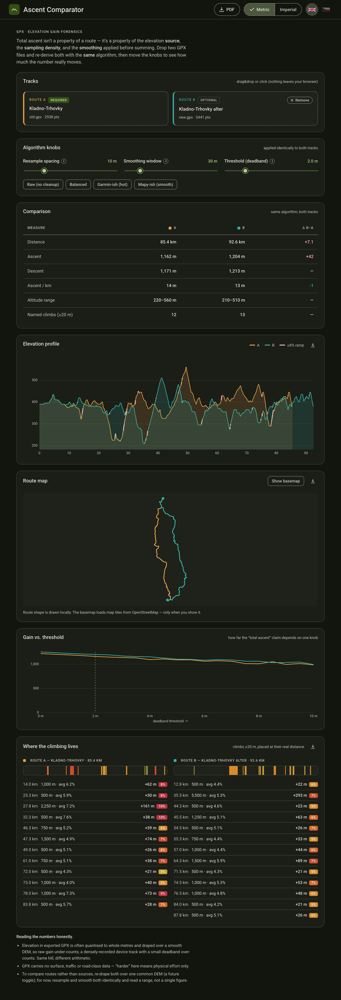

# GPX Ascent Comparator

A single-file, offline browser tool for comparing two GPX routes — and for understanding
**why different apps report wildly different "total ascent" for the same ride.**

Material Design 3 UI · English / Čeština · Metric / Imperial · light & dark.

👉 **Live:** _(enable GitHub Pages on this repo → Settings ▸ Pages ▸ Deploy from `main` / root)_


## Why this exists

Total ascent is not a property of a route. It's a **path-dependent sum** of positive elevation
deltas:

```
gain = Σ max(0, elevationᵢ − elevationᵢ₋₁)
```

That sum only ever *adds* upward wiggles and never lets descents cancel them, so the result
depends far more on **how the elevation series was produced and processed** than on the actual
terrain. Three tools tracing the identical GPS line can each report a different, defensible
number. The three knobs that matter:

1. **Elevation source (DEM).** Planners drape your 2D line over a digital elevation model and
   read heights off it. Different DEMs → different profiles → different sums. A recording device
   uses a barometric altimeter, which is accurate for *relative* change but drifts with weather.
2. **Sampling density.** Because gain accumulates every up-tick, *more points → more captured
   micro-relief → more ascent*. A sparse, road-snapped export under-counts; a 1-second device
   recording over-counts. Same hill, more staircase steps.
3. **Smoothing & deadband.** Every tool quietly smooths and applies a minimum-change threshold
   before summing — and they don't agree. This is where most of the disagreement hides.

Garmin online tends to read **higher** than Mapy.cz because its DEM has more vertical texture,
it samples more densely, and it uses a smaller deadband — all three push the number up.

## What the tool does

- Drag-drop **two** `.gpx` files (everything runs client-side; nothing is uploaded).
- Re-derives ascent/descent for **both** tracks with **one identical algorithm**, so you compare
  the *routes*, not the *apps*.
- Three live knobs — **resample spacing**, **smoothing window**, **deadband threshold** — plus
  presets (`Raw`, `Balanced`, `Garmin-ish`, `Mapy-ish`).
- **Elevation profile** overlay with ≥8% ramps highlighted and a hover crosshair.
- **Gain-vs-threshold** sensitivity chart: see how fragile the "total ascent" claim is to one knob.
- **Climb distribution**: named climbs (≥20 m) placed at their real distance, coloured by gradient.
- **Route map**: both routes drawn locally as a shape (offline, no requests) so you can see where
  the alternatives diverge, with an opt-in **Show basemap** button that lazy-loads an
  OpenStreetMap basemap only when you ask. Hovering the elevation profile drops a synced marker
  on the map.
- **English / Čeština** toggle (flags, top right) and a **Metric / Imperial** segmented control;
  both preferences persist. Numbers format to the active locale (e.g. `1 204 m` vs `1,204 m`).
- **Export**: each section (elevation profile, route map, climb distribution) has a **download-PNG**
  button (crisp 2–3× raster); the map exports whatever it's showing (offline shape or the tiled
  basemap, composited untainted from the CORS-enabled OSM tiles). A **PDF** button builds a
  one-click **A4-portrait report** — deterministic layout, no print dialog. Text is rasterised via
  Roboto so Czech diacritics render correctly.



<p align="center">
  
  
</p>

## The honest takeaway

Report a **range**, not a single figure. To compare *routes* rather than *sources*, resample and
smooth both identically (a common-DEM re-drape is on the roadmap).

## Run locally

No build, no dependencies. Just open `index.html` in a browser, or:

```bash
python3 -m http.server 8000   # then visit http://localhost:8000
```

## Design & tech

- **Material Design 3** tokens (seed: terrain green), full light + dark schemes.
- **Roboto**, self-hosted in `fonts/` with the `latin` + `latin-ext` subsets so Czech diacritics
  (č, ř, ž, ě, š, ů…) render correctly in both the UI and in GPX track/file names. No web-font CDN.
- Charts and the default route map are drawn on `<canvas>`; **no runtime dependencies and no
  network requests** — until you press **Show basemap**.
- **Leaflet** is vendored in `vendor/leaflet/` (BSD-2-Clause) and loaded lazily; the basemap uses
  keyless OpenStreetMap raster tiles (© OpenStreetMap contributors), fetched only when shown. So
  your GPX files never leave the browser, and the only optional external request is map tiles.
- **jsPDF** is vendored in `vendor/jspdf/` (MIT) and loaded lazily, only when you export a PDF.
  Section images and the PDF are rendered from the same canvas "core" draw functions, so exports
  match the screen exactly.

## Roadmap

- [ ] Re-drape both tracks over a common DEM via an elevation API (compare routes, not sources)
- [x] Export sections as PNG and the report as an A4 PDF
- [ ] CSV export of the per-climb table
- [ ] Optional Python port of the gain algorithm for batch processing

## Licence

MIT for the application code. Roboto is licensed under the Apache License 2.0 — see
[`fonts/NOTICE`](fonts/NOTICE).
