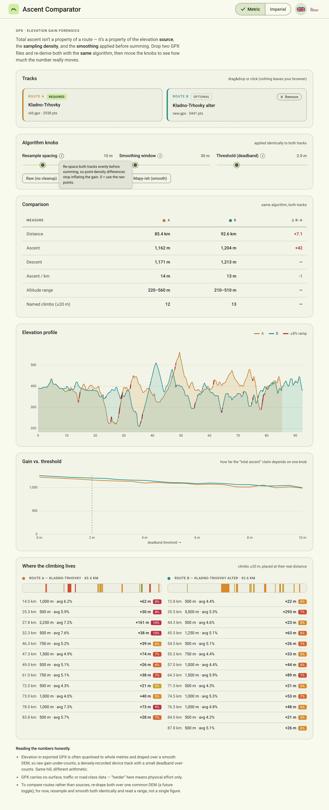

# GPX Ascent Comparator

A single-file, offline browser tool for comparing two GPX routes — and for understanding
**why different apps report wildly different "total ascent" for the same ride.**

👉 **Live:** _(enable GitHub Pages on this repo → Settings ▸ Pages ▸ Deploy from `main` / root)_



## Why this exists

Total ascent is not a property of a route. It's a **path-dependent sum** of positive elevation
deltas:

```
gain = Σ max(0, elevationᵢ − elevationᵢ₋₁)
```

That sum only ever *adds* upward wiggles and never lets descents cancel them, so the result
depends far more on **how the elevation series was produced and processed** than on the actual
terrain. Three tools tracing the identical GPS line can each report a different, defensible
number. The three knobs that matter:

1. **Elevation source (DEM).** Planners drape your 2D line over a digital elevation model and
   read heights off it. Different DEMs → different profiles → different sums. A recording device
   uses a barometric altimeter, which is accurate for *relative* change but drifts with weather.
2. **Sampling density.** Because gain accumulates every up-tick, *more points → more captured
   micro-relief → more ascent*. A sparse, road-snapped export undercounts; a 1-second device
   recording overcounts. Same hill, more staircase steps.
3. **Smoothing & deadband.** Every tool quietly smooths and applies a minimum-change threshold
   before summing — and they don't agree. This is where most of the disagreement hides.

Garmin online tends to read **higher** than Mapy.com because its DEM has more vertical texture,
it samples more densely, and it uses a smaller deadband — all three push the number up.

## What the tool does

- Drag-drop **two** `.gpx` files (everything runs client-side; nothing is uploaded).
- Re-derives ascent/descent for **both** tracks with **one identical algorithm**, so you compare
  the *routes*, not the *apps*.
- Three live knobs — **resample spacing**, **smoothing window**, **deadband threshold** — plus
  presets (`Raw`, `Balanced`, `Garmin-ish`, `Mapy-ish`).
- **Elevation profile** overlay with ≥8% ramps highlighted and a hover crosshair.
- **Gain-vs-threshold** sensitivity chart: see how fragile the "total ascent" claim is to one knob.
- **Climb distribution**: named climbs (≥20 m) placed at their real distance, colored by gradient.

## The honest takeaway

Report a **range**, not a single figure. To compare *routes* rather than *sources*, resample and
smooth both identically (a common-DEM re-drape is on the roadmap).

## Run locally

No build, no dependencies. Just open `index.html` in a browser, or:

```bash
python3 -m http.server 8000   # then visit http://localhost:8000
```

## Roadmap

- [ ] Re-drape both tracks over a common DEM via an elevation API (compare routes, not sources)
- [ ] Export the comparison as PNG / CSV
- [ ] Optional Python port of the gain algorithm for batch processing

## License

MIT
